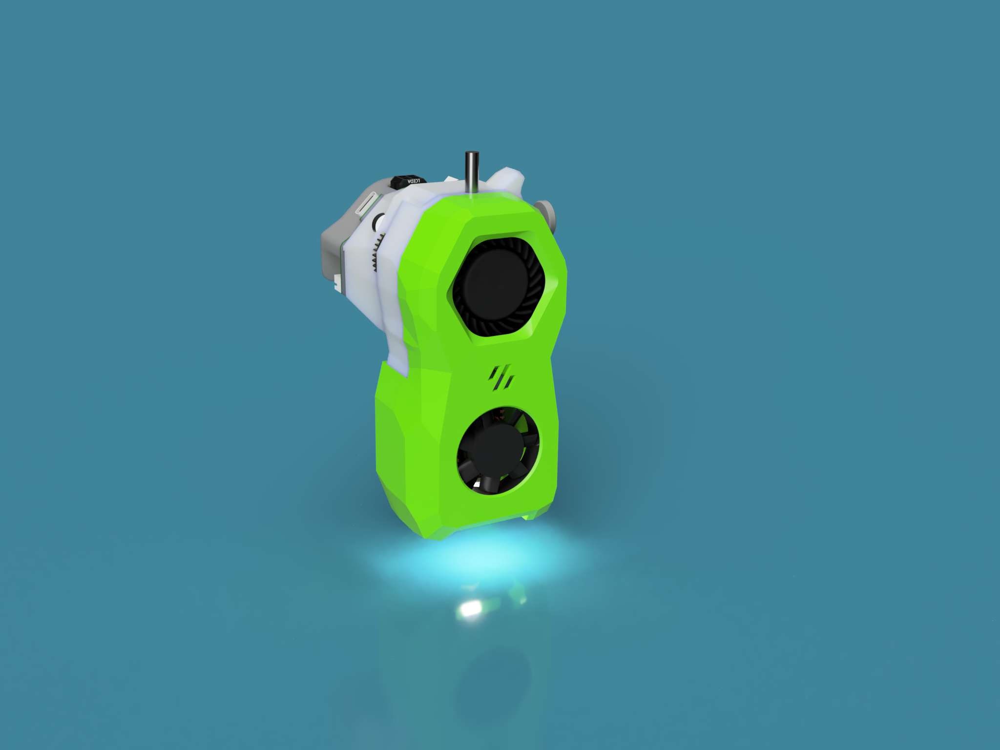

# Changelog

21.3.23
- 20mm EBB CAN Mount stl added

12.2.2023
- updated CAD file (assembled) - there where some parts missing in the CAD
- added a shortage prevention cover for the euklid probe
- bigger mounting holes for euklid probe to prevent braking the part

8.1.23
- pin mod updated

5.1.2012 RC1
- see discription above
- note that the manual has not been updated yet
- same for the pin mod

06.01.2023
- new gearbox front STL for Bontech Push Collet
- updated mid section with locking bolts for cowling
- updated rear section with more room for cable management
- Cowling: bolt locking added. Updated cable channels
- New mount for BTT EBB 36 Can Bus boards 

15.12.2022
- Added a sub-folder in the STL's directory with part required for those using a stripped done LGX-Lite
- Added a sub-folder in the STL's directory with a mount and cover for the PanCake board
- Alternate gearbox front-section that uses a Bondtech Push-Fit collet instead on the E3D collet

12.12.2022:
- Draft Manual added

11.12.2022:  Beta-1
- Functional Extruder CAD and STL's released
- No bells and whistles for now. LED's and Filament sensor requires some more thonkering
- Basic Rear Cover added to help with cable managment
- Srepper gear mesh adjustmet added
 

05.12.2022:

- 1'st 1:1 prototype assembled
- went trough a compleate redesign for the cowling and the gearbox
- nothing to release yet, however the CAD is in the repo for a first review

## Some renderings of the new Design

# Some first shots ..

https://user-images.githubusercontent.com/1899323/203817806-552646dd-b743-40ac-975e-db16fed9496d.mp4

