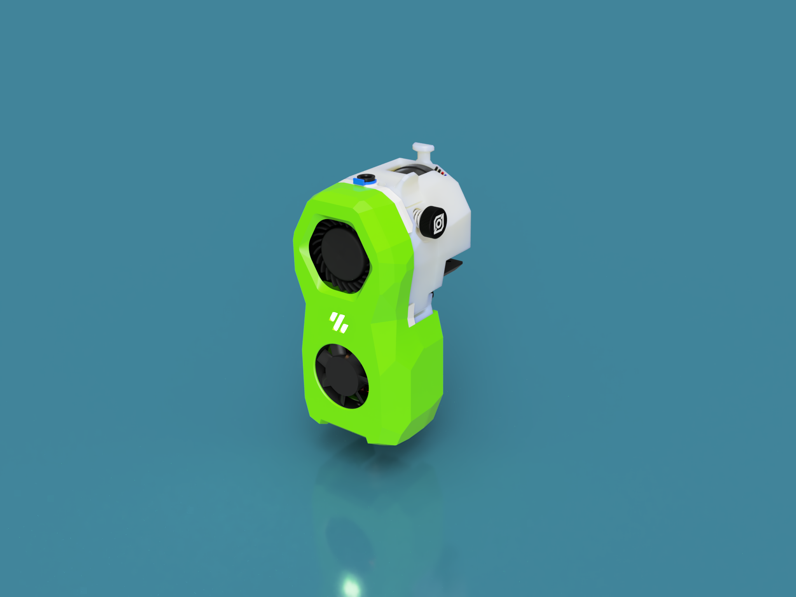
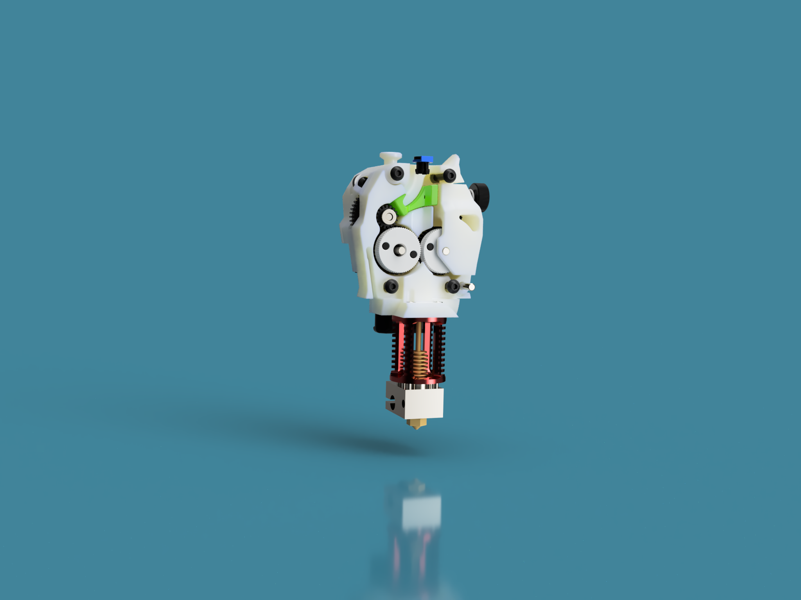
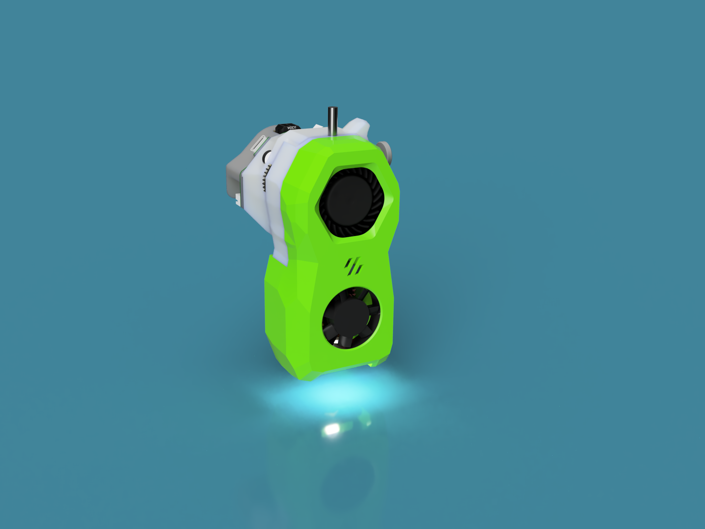
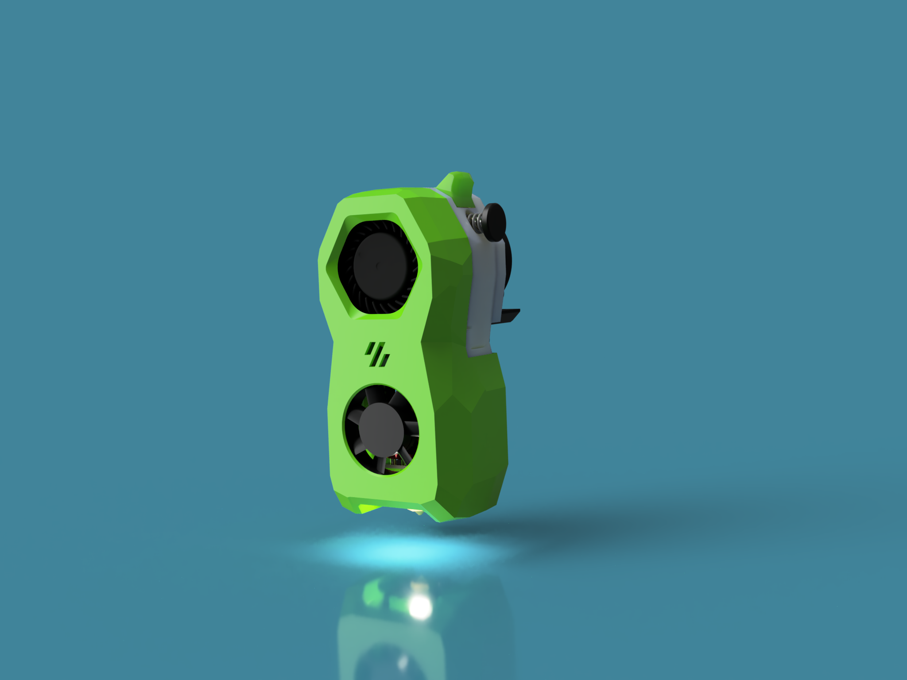
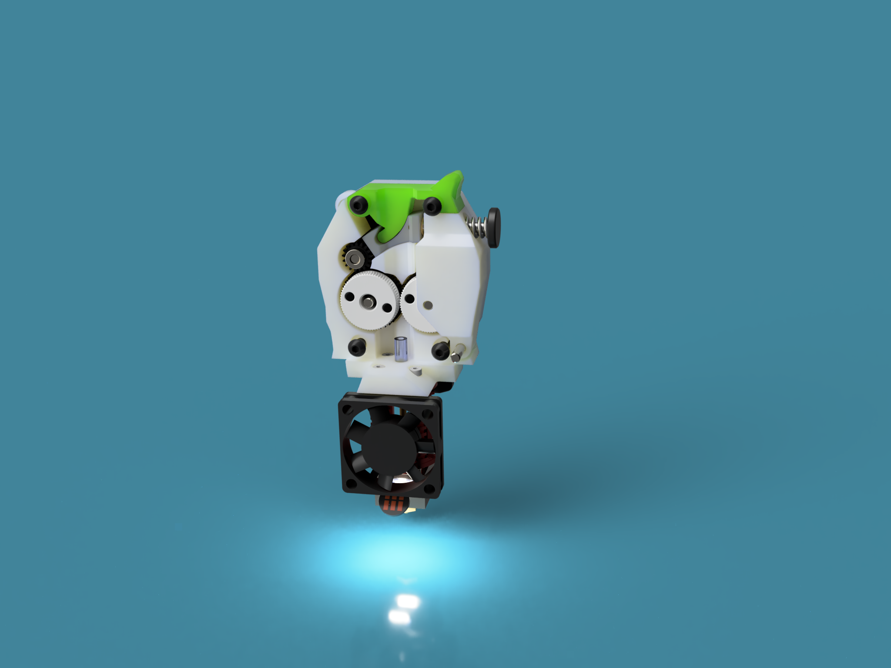
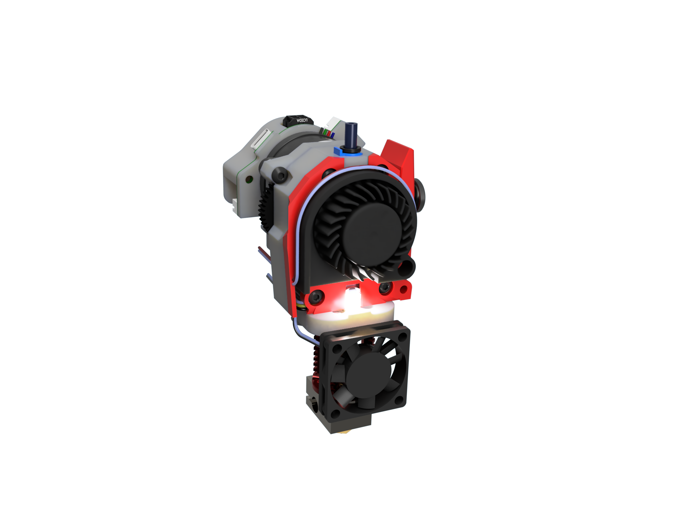
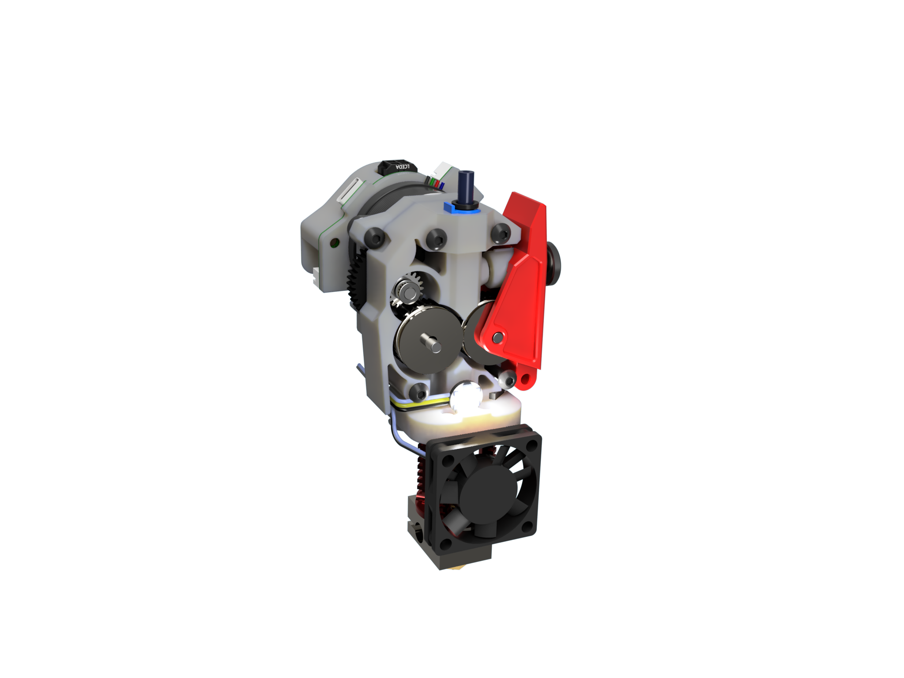

# Ghost LG Toolhead - Beta-1 11.12.2022

A V0 Toolhead using LGX Gears

## Design Goals

- Print Quality
    The Mini AB is hard to get right. Missaligment on the drive gears and also potetial of centric gears due to the set screws affect print quality
    The LGX Gears solve this problem by running on needle bearings and not using set screws. They can also move axial on the bearings, which basicaly means that they are self adjusting.
- Maintain MINI AB footprint
    At least on the important dimensions which are 
    - Mount to font 
    - Distance to Top (to maintan clearence with tophead)
    - Width (espacialy for IDEX use)
    The Ghost LG maintains thode measuremets by beeing 3mm smaller on width
    Distance to the beack is +5mm (there is enough room here)
    Distance to the nozzle end is +4mm dragon and +6mm Revo.
    This meas that the bed needs to belowered by those distances. This is no Issue for the V0 and most of the Ant printers.
- Voron Design language
    Well basicaly the new stealth design 
- Optimized for IDEX 
    Minimize with (-3mm)
    Nozzle height adjustment. There is a slot for the mounting screws to the X-carriage to enable some height adjuszment.
- Easy to assamble

## Printing notes

All parts print with standard Voron settings and no supports.
However the parts have fine details and tight tolerances. Make sure you printer is erll calibratd and use reasonable print speeds

## BOM

The project is stoill in its early stage so the BOM is subject to changes.
However I try to maintain the items below for the final design.

### Required Parts

| Item                         	| Amount 	| Sourcing                                              	| Notes               	|
|------------------------------	|--------	|-------------------------------------------------------	|---------------------	|
| HGX-Lite Etruder Gear Kit    	| 1      	| https://www.aliexpress.com/item/1005004699143725.html 	| Provided 3mm pins can be used but do not allign with case                    	|
| 4015 Turbo Blower 40x40x15MM 	| 1      	| https://www.aliexpress.com/item/1005004909471864.html 	| Modifcation required  |
| 3010 axial fan 24V	| 1      	| 	|  |
| Hotend 	                    | 1      	| Phaetos Dragon  	|  Revo in preparation   |
| M3x18 BHSC                   	| 2      	|                                                       	| 	|
| M3x20 BHSC                   	| 2      	|                                                       	| 	|
| M3x6 BHSC                   	| 4      	|                                                       	| 	|
| M3x6 countersunk flat head screws                   	| 1      	|                                                       	| 	|
| M3 Heat Inserts               | 5      	|                                                       	| 	|
| PTFE Tube                   	| 17mm      |                                                       	|  	                    |

### Optional Parts

| Item                         	| Amount 	| Sourcing                                              	| Notes               	|
|------------------------------	|--------	|-------------------------------------------------------	|---------------------	|
| Individual NeoPixels     	    | 2      	| https://learn.adafruit.com/adafruit-neopixel-uberguide/individual-neopixels	|                     	|
| 3x15mm Pin                    | 3         | https://www.aliexpress.com/item/1005002473550667.html | For those who want the pins alligned with the case |
| Omron Mouse Button - Micro Switch | 1 |               | For filamentsensor (if üpossible) |
| 4.5 mmm Stainless Steel Solid Ball | 1 | https://www.aliexpress.com/item/1005004091669583.html | For filamentsensor (if üpossible) |

# Changelog:

11.12.2022:  Beta-1
- Functional Extruder CAD and STL's released
- No bells and whistles for now. LED's and Filament sensor requires some more thonkering
- Basic Rear Cover added to help with cable managment
- Srepper gear mesh adjustmet added
 

05.12.2022:

- 1'st 1:1 prototype assembled
- went trough a compleate redesign for the cowling and the gearbox
- nothing to release yet, however the CAD is in the repo for a first review

## Some renderings of the new Design

# Some first shots ..

https://user-images.githubusercontent.com/1899323/203817806-552646dd-b743-40ac-975e-db16fed9496d.mp4

