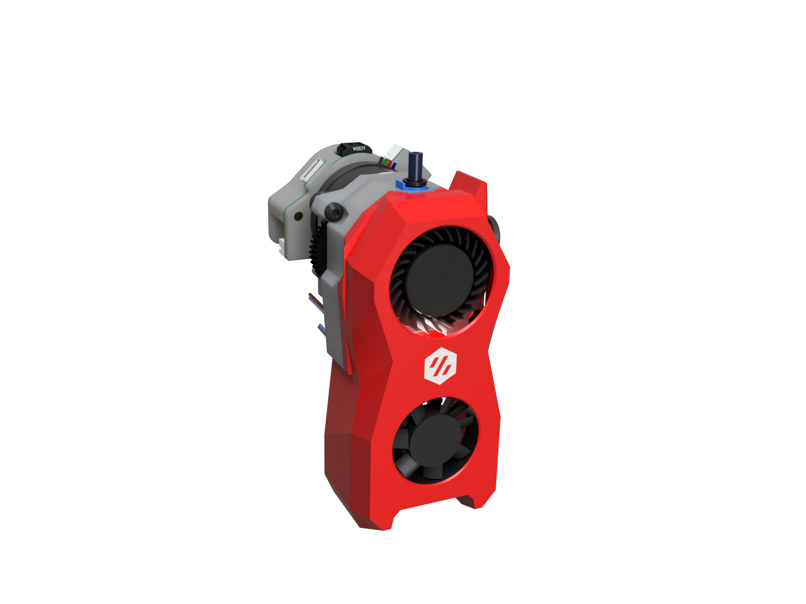

# Ghost LG Toolhead - RC1 - 5.1.23

A V0 Toolhead using LGX Gears

This is the release candidate 1. The beta version had plenty of testing with great results, and as expected room for improvements.
So, this release adds new features as well as many enhancements over the beta release.

New Features:

- Various cowling covers with mounts for probes
    - Euklic Probe - This is the one the I was using during the beta tests
      I'm using the euklid probe with my ServoKlicky dock
    - ZeroClick - mount for zruncho's clicky probe. The position as derived from the MiniAB, so it should work with the docks
    - PINDA inductive probe. Popular probe used on the Prusa MK3 printers. Maybe not the most accurate but defiantly the most hassle free installation.
      No Dock or complex macro definitions required. Not the klipper currently does not support the 4 wire probe with temp compensation in the firmware.
      If you like to have temp compensation make shure you order a Super PINDA (https://www.aliexpress.com/item/1005004488098625.html)
    - and last but not least a cover without any probe mounts

- New diffusor for Logo LED 
    - Maybe not for everybody as wiring is not easy.

- Anti squish adjustment thingy 
    - I don't think that's a requirement but a added one because this as popular right now

- Mounting screws for the cowling
    - The click on cowling came off a few times during my tests. So I added some self-tapping screws to mount it on the gearbox.
      This makes the whole toolhead way more rigid which is especially important for all cowling that have probes attached

Enhancements

- Cowling
    - fighting thin walls. Lots of tweaks here and there to improve printability 
    - New fan ducts. They are now moved forward like on the MiniSB. This allows for probe mounts without impact on the air channels
    - Improved air channels.
        The overall cooling performance is surprisingly good. But there was less cooling on the front side of the prints.
        The new air channels provide better flow in that area
    - Wiring channels
        The toolhead is now 2mm wider at the rear center (still same footprint). This creates more room for the wires exiting the toolhead
        Wire channel for cooling fan and nozzle LED redesigned.
        This section has now a break-away support which allows to route the wires without heaving to rempove the connectors.
        Also the cable channels are increased in size
    - Some minor design tweak on top of the toolhead for aesthetic reasons

- Gearbox
    - As mentioned the gearbox is now 2mm wider mid center (it not really visually noticeable)
    - Much wider cable channels to simplify wiring
    - New Latch geometry.
        The latch now pushed the idler back when opened (was a community suggestion)
    - Strengthened latch shuttle
    - Mid and rear section are bolted together with a countersunk screw.
        This make the toolhead much more rigid
    - Small changes on the idler to provide access to the anti-squish thing
    - the standard bowden collet is now the one from bondtech. It's much smaller and works better

- Board Mounts
    - EBB36 Mount
        - added a zip mount for the heater and thermistor wires
        - added a zip mount for the CANbus cable to eliminate stress on the connector and wires
    - The other mounts have no changes

## RC1 with EBB36 mount

## PINDA Probe mount

## Euklid Probe Mount

## ZeroClick Probe Mount

## Logo LED / Wire channel with break-away support / New fan ducts

## New latch geometry / Anti-squish adjustment

## Design Goals

-	Print Quality: 

    The Mini AB is hard to get right. Misalignment on the drive gears and also potential of centric gears due to the set screws affect print quality The LGX Gears solve this problem by running on needle bearings and not using set screws. They can also move axial on the bearings, which basically means that they are self-adjusting.
-	Maintain MINI AB footprint 

    At least on the important dimensions which are
	- Mount to front
    - Distance to Top (to maintain clearance with top-head)
    - Width (especially for IDEX use) 
        
	
The Ghost LG maintains those measurements by being 3mm smaller on width Distance to the back is +5mm (there is enough room here) Distance to the nozzle end is +4mm dragon and +6mm Revo. This means that the bed needs to be lowered by those distances. This is no Issue for the V0 and most of the Ant printers.

- Voron Design language Well basically the new stealth design

- Optimized for IDEX Minimize with (-3mm) Nozzle height adjustment. There is a slot for the mounting screws to the X-carriage to enable some height adjustment.

- Easy to assemble

## Printing notes

All parts print with standard Voron settings and no supports.
However the parts have fine details and tight tolerances. Make sure you printer is erll calibratd and use reasonable print speeds
Consider a brim for the EBB mount as the contact patch on the print bed is very small

## BOM

The project is stoill in its early stage so the BOM is subject to changes.
However I try to maintain the items below for the final design.

### Required Parts

| Item                         	| Amount 	| Sourcing                                              	| Notes               	|
|------------------------------	|--------	|-------------------------------------------------------	|---------------------	|
| HGX-Lite Etruder Gear Kit    	| 1      	| https://www.aliexpress.com/item/1005004699143725.html 	| Provided 3mm pins can be used but do not allign with case                    	|
| 4015 Turbo Blower 40x40x15MM 	| 1      	| https://www.aliexpress.com/item/1005004909471864.html 	| Modifcation required  |
| 3007 axial fan 	| 1      	| 	|  |
| Hotend 	                    | 1      	| Phaetos Dragon  	|  Revo in preparation   |
| Nema 14 36mm pankake stepper motor	                    | 1      	| 17mm or 20mm  	|  use the right rear cover  |
| M3x18 BHSC                   	| 2      	|                                                       	| 	|
| M3x20 BHSC                   	| 2      	|                                                       	| 	|
| M3x6 BHSC                   	| 4      	|                                                       	| 	|
| M3x6 countersunk flat head screws                   	| 3      	|                                                       	| 	|
| 2x8 or 2x10 self tapping screw                   	| 2      	|                                                       	| 	|
| M3 Heat Inserts               | 6      	|                                                       	| 	|
| PTFE Tube                   	| 17mm      |                                                       	|  	                    |

### Optional Parts

| Item                         	| Amount 	| Sourcing                                              	| Notes               	|
|------------------------------	|--------	|-------------------------------------------------------	|---------------------	|
| Individual NeoPixels     	    | 2      	| https://learn.adafruit.com/adafruit-neopixel-uberguide/individual-neopixels	|                     	|
| 3x15mm Pin                    | 3         | https://www.aliexpress.com/item/1005002473550667.html | For those who want the pins alligned with the case |
| Omron Mouse Button - Micro Switch | 1 |               | For filamentsensor (if üpossible) |
| 4.5 mmm Stainless Steel Solid Ball | 1 | https://www.aliexpress.com/item/1005004091669583.html | For filamentsensor (if üpossible) |

# Changelog:

5.1.2012 RC1
- see discription above
- note that the manual has not been updated yet
- same for the pin mod

06.01.2023
- new gearbox front STL for Bontech Push Collet
- updated mid section with locking bolts for cowling
- updated rear section with more room for cable management
- Cowling: bolt locking added. Updated cable channels
- New mount for BTT EBB 36 Can Bus boards 

15.12.2022
- Added a sub-folder in the STL's directory with part required for those using a stripped done LGX-Lite
- Added a sub-folder in the STL's directory with a mount and cover for the PanCake board
- Alternate gearbox front-section that uses a Bondtech Push-Fit collet instead on the E3D collet

12.12.2022:
- Draft Manual added

11.12.2022:  Beta-1
- Functional Extruder CAD and STL's released
- No bells and whistles for now. LED's and Filament sensor requires some more thonkering
- Basic Rear Cover added to help with cable managment
- Srepper gear mesh adjustmet added
 

05.12.2022:

- 1'st 1:1 prototype assembled
- went trough a compleate redesign for the cowling and the gearbox
- nothing to release yet, however the CAD is in the repo for a first review

## Some renderings of the new Design

# Some first shots ..

https://user-images.githubusercontent.com/1899323/203817806-552646dd-b743-40ac-975e-db16fed9496d.mp4

